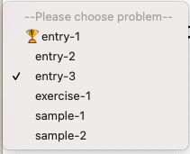

# SQLabo

## 概要
ブラウザ上で、SQL をクイズ形式で練習できるアプリケーションです。  

### 動機
プログラミング（アルゴリズム実装）を練習できるサービスは存在しますが、SQL を練習できるものは見当たらなかったため、自分で作りました。

### 使い方
1. https://sqlabo.herokuapp.com/ にアクセスします
2. リストから問題を選びます
3. 与えられたテーブル、説明文や出力例を読み、要件を満たす SQL 文を書きます
4. 提出します
5. 結果を確認します

### 特徴
- 独立したデータベース上で、テーブルを作成し、ユーザのクエリを実行し、結果を模範解答と照らし合わせて正誤判定します
- 簡易的なアカウント機能があります
    - ログインすると、過去にクリアした問題が一目でわかるようになります
    		
        

- 誰でも問題を作成し、投稿できます
    - 全ての問題は、所定のフォーマットに従った JSON 形式で記述されています
    - 問題は GitHub での PR で受け付けられ、内容をチェックしてから反映されます
        - データベースで管理し、直接 POST させることも考えましたが、あえてしていません
- 日本語と英語に対応しています

## 使用しているライブラリ
このソフトウェアは，他者のライブラリを用いています

- natsort
    - https://github.com/SethMMorton/natsort
    - by SethMMorton et al.

---

Copyright (c) 2021 Tetsuya Hori a.k.a. ryhoh / shirosha2
