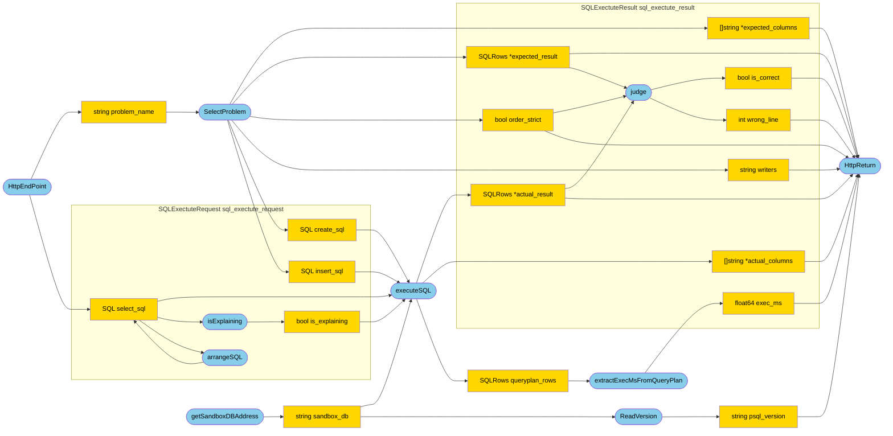
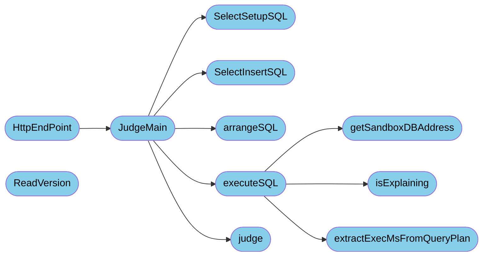
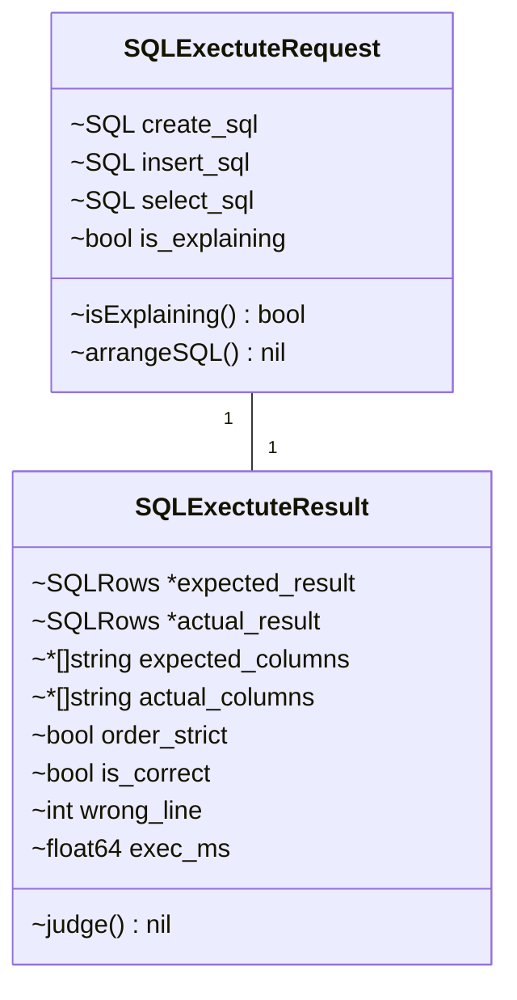

## 1. DFD

```mermaid
graph LR
    sandbox_db --> executeSQL([executeSQL])
    %%SQLoversDB[(SQLoversDB)] --> SelectCreateSQL([SelectCreateSQL])
    %%SQLoversDB[(SQLoversDB)] --> SelectInsertSQL([SelectInsertSQL])

    subgraph SQLExectuteRequest[SQLExectuteRequest sql_exectute_request]
        create_sql[SQL create_sql]
        insert_sql[SQL insert_sql]
        select_sql[SQL select_sql]
        is_explaining[bool is_explaining]

        isExplaining([isExplaining])
        arrangeSQL([arrangeSQL])
    end
    
    
    subgraph SQLExectuteResult[SQLExectuteResult sql_exectute_result]
        expected_result[SQLRows *expected_result]
        actual_result[SQLRows *actual_result]
        expected_columns["[]string" *expected_columns]
        actual_columns["[]string" *actual_columns]
        order_strict[bool order_strict]
        is_correct[bool is_correct]
        wrong_line[int wrong_line]
        exec_ms[float64 exec_ms]
        writers[string writers]
        
        judge([judge])
    end

    HttpEndPoint([HttpEndPoint]) --> problem_name[string problem_name]
    problem_name --> SelectProblem([SelectProblem])
    SelectProblem --> create_sql
    SelectProblem --> insert_sql
    SelectProblem --> expected_columns
    SelectProblem --> expected_result
    SelectProblem --> order_strict
    SelectProblem --> writers
    HttpEndPoint --> select_sql
    create_sql --> executeSQL
    insert_sql --> executeSQL
    select_sql --> executeSQL
    select_sql --> isExplaining([isExplaining]) --> is_explaining --> executeSQL
    select_sql --> arrangeSQL([arrangeSQL]) --> select_sql
    executeSQL --> actual_result
    executeSQL --> actual_columns
    executeSQL --> queryplan_rows[SQLRows queryplan_rows]
    queryplan_rows --> extractExecMsFromQueryPlan([extractExecMsFromQueryPlan])
    extractExecMsFromQueryPlan --> exec_ms

    expected_result --> HttpReturn([HttpReturn])

    expected_result --> judge
    actual_result --> judge
    order_strict --> judge
    judge --> is_correct
    judge --> wrong_line
    
    getSandboxDBAddress([getSandboxDBAddress]) --> sandbox_db[string sandbox_db]

    actual_result --> HttpReturn
    expected_columns --> HttpReturn
    actual_columns --> HttpReturn
    is_correct --> HttpReturn
    wrong_line --> HttpReturn
    order_strict --> HttpReturn
    exec_ms --> HttpReturn
    writers --> HttpReturn

    sandbox_db --> ReadVersion([ReadVersion]) --> psql_version[string psql_version] --> HttpReturn

    %% style
    classDef func fill:skyblue,color:#000
    classDef data fill:gold,color:#000
    classDef database fill:lightgray,color:#000

    class getSandboxDBAddress,executeSQL,HttpEndPoint,judge,HttpReturn,arrangeSQL,SelectProblem,ReadVersion,isExplaining,extractExecMsFromQueryPlan func;
    class sandbox_db,create_sql,insert_sql,select_sql,expected_result,actual_result,order_strict,expected_columns,actual_columns,is_correct,wrong_line,problem_name,base_table,exec_ms,psql_version,is_explaining,queryplan_rows,writers data;
    class SQLoversDB database;
```

## 2. Call Tree

```mermaid
graph LR
    JudgeMain([JudgeMain]) --> SelectSetupSQL([SelectSetupSQL])
    JudgeMain([JudgeMain]) --> SelectInsertSQL([SelectInsertSQL])
    HttpEndPoint([HttpEndPoint]) --> JudgeMain([JudgeMain]) --> arrangeSQL([arrangeSQL])
    JudgeMain([JudgeMain]) --> executeSQL([executeSQL]) --> getSandboxDBAddress([getSandboxDBAddress])
    executeSQL --> isExplaining([isExplaining])
    executeSQL --> extractExecMsFromQueryPlan([extractExecMsFromQueryPlan])
    JudgeMain([JudgeMain]) --> judge([judge])

    ReadVersion([ReadVersion])

    classDef func fill:skyblue,color:#000
    
    class HttpEndPoint,JudgeMain,arrangeSQL,executeSQL,getSandboxDBAddress,judge,SelectSetupSQL,SelectInsertSQL,isExplaining,extractExecMsFromQueryPlan,ReadVersion func;
```

## 3. Class Diagram

```mermaid
classDiagram
class SQLExectuteRequest {
    ~SQL create_sql
    ~SQL insert_sql
    ~SQL select_sql
    ~bool is_explaining

    ~isExplaining() bool
    ~arrangeSQL() nil
}

class SQLExectuteResult {
    ~SQLRows *expected_result
    ~SQLRows *actual_result
    ~*[]string expected_columns
    ~*[]string actual_columns
    ~bool order_strict
    ~bool is_correct
    ~int wrong_line
    ~float64 exec_ms
    
    ~judge() nil
}

SQLExectuteRequest "1" -- "1" SQLExectuteResult

```
